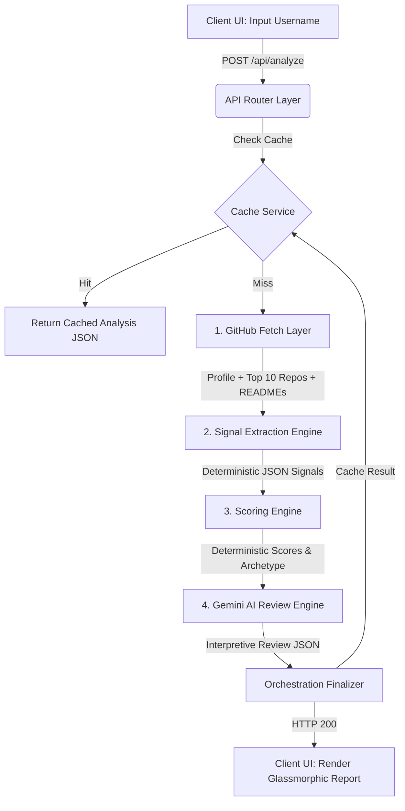

# 🛡️ Git-XRay — Developer-First AI Profile Reviewer

[](https://nextjs.org/)
[](https://www.typescriptlang.org/)
[](https://ai.google.dev/)
[](https://supabase.com/)
[](https://tailwindcss.com/)
[](https://www.framer.com/motion/)
[](https://posthog.com/)

**Git-XRay** is an AI-powered GitHub profile analysis and review platform. Unlike generic statistical dashboards, Git-XRay serves as an emotional, highly insightful, and visually stunning developer profile reviewer. It extracts raw metadata and repository-level details to compile a deterministic developer score and generates a recruiter-grade analysis using **Gemini 2.0 Flash**.

The primary design principle is simple:
```txt
GitHub Username ──> Deterministic Signals & Scores ──> Recruiter-Style AI Review
```

---

## 📖 Table of Contents
1. [Core Philosophy](#-core-philosophy)
2. [Technical Architecture](#-technical-architecture)
3. [Key Features](#-key-features)
4. [Folder Structure](#-folder-structure)
5. [Deterministic Scoring Engine Deep-Dive](#-deterministic-scoring-engine-deep-dive)
6. [Local Setup Guide](#-local-setup-guide)
7. [Database Setup (Supabase)](#-database-setup-supabase)
8. [Logging & Engineering Standards](#-logging-&-engineering-standards)
9. [Deployment](#-deployment)

---

## 🧠 Core Philosophy

Most developer analysis tools fail because they focus entirely on raw commit numbers, green contribution boxes, and other easily gamified statistics. 

**Git-XRay** is built around the philosophy of **code stewardship, production-readiness, and developer branding**:
* **Recruiter-Style Perspective:** It acts as a professional technical recruiter reviewing your public footprint, assessing how hireable and ready your projects actually are.
* **Separation of Concerns:** AI never computes raw scores. All scores are computed deterministically using raw signals, while the AI is used exclusively for interpretation, feedback, and personality formulation (Standard, Brutal, and Recruiter-grade reviews).
* **High Polish & Micro-animations:** An immersive dark-mode developer experience leveraging custom glassmorphic panels, dynamic gauges, progress indicators, and Framer Motion transitions.

---

## 🏗️ Technical Architecture

Git-XRay is built on a stateless, lightning-fast Next.js architecture. The entire candidate evaluation pipeline operates synchronously within a single Next.js API route:



### The Pipeline Mechanics:
1. **Caching Layer:** Queries Supabase Cache (with an in-memory Map fallback). Checks if a valid cached analysis exists within the TTL (30 Days).
2. **GitHub Fetch Layer:** Connects to the GitHub REST API using `axios`. It fetches the primary profile and queries the top 5–10 meaningful repositories (filtering out empty repos, forks, and archives), fetching their full `README` payloads.
3. **Signal Extraction Engine:** A zero-LLM, fully deterministic module. It parses project layouts, documentation length, setup guides, and deployment configurations to extract raw numbers and qualitative signals.
4. **Scoring Engine:** Takes the extracted signals and maps them to a series of diagnostic indexes (Code Stewardship, Production Deployability, Specialization Depth, Community Adoption) to form a deterministic Candidate Score.
5. **AI Review Engine (Gemini 2.0 Flash):** Processes the structured signals and scores, utilizing custom systemic prompting to format hiring match lists, highest-impact improvements, explainability pros/cons, and distinct tone-driven review formats.

---

## ⚡ Key Features

* **Profile Analysis & Diagnostics:** Instantly evaluates account age, follower counts, portfolio presence, and general bio quality.
* **Deterministic Project Scopes:** Crawls repository topics, descriptions, and setups. Detects deployment footprints (Vercel, Netlify, Cloudflare Pages, GitHub Pages) and reviews documentation depth.
* **Double-Tier AI Reviews:** Generates structured recruiter impressions alongside standard and brutally honest developer roast reviews.
* **Shareability Suite:** Produces dynamic metrics formatted for immediate sharing on LinkedIn, X/Twitter, or as a direct clipboard link.
* **Supabase & Memory Hybrid Caching:** Optimizes performance and prevents rate-limiting using hybrid caching with automated stale-check purges.
* **PostHog Event Tracker:** Integrates user clicks, sharing interactions, and processing analytics pipelines.

---

## 📂 Folder Structure

```txt
src/
├── app/
│   ├── api/
│   │   └── analyze/
│   │       └── route.ts             # Main API pipeline orchestration
│   ├── page.tsx                     # Landing page entrypoint
│   ├── layout.tsx                   # Global CSS & HTML wrapping
│
├── components/
│   ├── landing/                     # Landing page panels & CTA widgets
│   ├── loading/                     # Progressive scanning steps & animations
│   ├── report/                      # Glassmorphic report cards & Gauges
│
├── services/
│   ├── github/
│   │   └── github.service.ts        # GitHub API REST client
│   ├── signals/
│   │   └── signal-engine.ts         # Deterministic signal crawler
│   ├── scoring/
│   │   └── scoring-engine.ts        # Arithmetic scoring algorithms
│   ├── ai/
│   │   └── gemini.service.ts        # Gemini API review & JSON formulator
│   └── cache/
│       └── cache.service.ts         # Supabase + memory caching provider
│
├── types/
│   ├── github.types.ts              # API contracts for GitHub REST models
│   ├── signals.types.ts             # Struct definitions for computed signals
│   └── report.types.ts              # Output interface for completed reports
│
├── lib/                             # Core utilities (styling wrappers, shared configs)
└── utils/                           # General helpers and string formatters
```

---

## 🧮 Deterministic Scoring Engine Deep-Dive

To preserve transparency and trustworthiness, Git-XRay never leaves developer scores up to LLM hallucinations. All dimensions are calculated deterministically:

| Score Category | Weight | Focus Areas | Computation Logic |
| :--- | :--- | :--- | :--- |
| **Consistency** | 15% | Development pacing and account lifespan | Combines active repo counts, recent pushes (last 90 days), and account age. |
| **Project Quality** | 25% | Documentation and production readiness | Evaluates average README scores and deployment configurations. |
| **Technical Depth** | 20% | Domain focus and architectural complexity | Rewards technical specialization (e.g., focused stacks vs scattered setups) paired with documentation. |
| **Profile Branding** | 15% | Public presentation and developer presence | Scans for website links, comprehensive bios, custom avatars, and follower indexes. |
| **Recruiter Ready** | 15% | Commercial hireability | Weights live deployments, documentation compliance, and custom portfolio presence. |
| **Open Source** | 10% | Collaboration and social proofing | Measures repository forks, community stars, and contributions to external codebases. |

### Archetype Identification
The scoring engine automatically categorizes developers into premium archetypes based on raw code signals:
* 🤖 **AI / ML Explorer:** High Python saturation + $>=2$ active AI/ML projects.
* 🎨 **Frontend Craftsman:** High JS/TS focus + front-end framework topic density.
* ⚙️ **Backend Specialist / Systems Architect:** Multi-database configurations + high technical depth indexes.
* 🌐 **Open Source Explorer:** Elevated collaborative project parameters + external contribution indexes.
* ⚡ **Hackathon Builder:** High repository velocity with constant pushing actions.
* 🏆 **Full Stack Craftsman:** Even distribution of frontend/backend projects with high overall score.

---

## 🚀 Local Setup Guide

Follow these steps to run Git-XRay on your local machine:

### 1. Prerequisites
Ensure you have the following installed:
* [Node.js](https://nodejs.org/) (v18.0.0 or higher)
* [npm](https://www.npmjs.com/) or [yarn](https://yarnpkg.com/)
* A GitHub account (for generating developer access tokens)
* A Google AI Studio API Key (for Gemini)

### 2. Clone the Repository
```bash
git clone https://github.com/Durgaprasad-Developer/Git-XRay.git
cd Git-XRay
```

### 3. Install Dependencies
```bash
npm install
```

### 4. Configure Environment Variables
Create a `.env.local` file in the root directory and add the following keys:
```env
# GitHub Token (Optional but highly recommended to bypass public rate limits)
# Generate one here: https://github.com/settings/tokens
GITHUB_TOKEN=your_github_personal_access_token

# Google Gemini API Key
# Get your API key from Google AI Studio: https://aistudio.google.com/
GEMINI_API_KEY=your_gemini_api_key

# Supabase Configurations (Optional - falls back to memory cache if omitted)
SUPABASE_URL=your_supabase_project_url
SUPABASE_ANON_KEY=your_supabase_anon_key

# PostHog Analytics (Optional)
NEXT_PUBLIC_POSTHOG_KEY=your_posthog_client_key
NEXT_PUBLIC_POSTHOG_HOST=https://us.i.posthog.com
```

### 5. Start Development Server
```bash
npm run dev
```
Open [http://localhost:3000](http://localhost:3000) in your browser to test the application!

---

## 🗄️ Database Setup (Supabase)

Git-XRay uses Supabase to cache candidate reports for **30 days**. To set up the caching database table, follow these steps:

1. Create a free database at [Supabase](https://supabase.com/).
2. Navigate to your project's **SQL Editor** from the sidebar.
3. Paste and run the following script to create the schema, lower-case search index, and set up public Row Level Security (RLS) policies:

```sql
-- ==========================================
-- GitHub Xray — Supabase Caching Schema Setup
-- ==========================================

-- 1. Create the caching table
CREATE TABLE IF NOT EXISTS public.cached_reports (
    username text PRIMARY KEY,
    report_json jsonb NOT NULL,
    created_at timestamp with time zone DEFAULT timezone('utc'::text, now()) NOT NULL
);

-- 2. Create index on username (lowercase) for fast search lookups
CREATE INDEX IF NOT EXISTS idx_cached_reports_username_lower ON public.cached_reports (lower(username));

-- 3. Enable Row Level Security (RLS)
ALTER TABLE public.cached_reports ENABLE ROW LEVEL SECURITY;

-- 4. Create Public Access Policies
-- Policy: Allow read access for any public client
CREATE POLICY "Allow public read access" 
ON public.cached_reports 
FOR SELECT 
USING (true);

-- Policy: Allow public insert access
CREATE POLICY "Allow public insert access" 
ON public.cached_reports 
FOR INSERT 
WITH CHECK (true);

-- Policy: Allow public update access
CREATE POLICY "Allow public update access" 
ON public.cached_reports 
FOR UPDATE 
USING (true)
WITH CHECK (true);

-- Policy: Allow public delete access (to purge stale cache rows)
CREATE POLICY "Allow public delete access" 
ON public.cached_reports 
FOR DELETE 
USING (true);
```

---

## 📝 Logging & Engineering Standards

Git-XRay enforces highly structured, verbose console logging for rapid debugging in development and production environments.

### Standard Log Format:
All key layers must print structured logging tags during their operational loops:
```ts
console.log("[GitHub Fetch] Fetching profile:", username);
console.log("[Signal Engine] Signals successfully computed:", signals);
console.log("[Scoring Engine] Deterministic scoring completed:", scores);
console.log("[Cache Hit - Supabase] Found cached report for:", username);
console.error("[AI Engine Error] Fatal crash in review generation:", error);
```

### Core Architecture Integrity Rules:
1. **Never pass raw GitHub JSON to the LLM:** To keep latency ultra-low and optimize payload sizes, only structured, precomputed developer signals and score summaries are provided to the Gemini model.
2. **Deterministic-First, AI-Second:** All math is computed arithmetically inside Next.js services. The AI is utilized exclusively for generating natural-language, tone-sensitive summaries, recommendations, and reviews.
3. **Graceful Error Recovery:** If GitHub API throws a rate limit or Gemini fails temporarily, appropriate status codes are propagated, with clean user-friendly messages rendered on the frontend dashboard.

---

## 📦 Deployment

### Deploying to Vercel
The easiest way to deploy Git-XRay is with the [Vercel Platform](https://vercel.com/new):

1. Push your repository to GitHub, GitLab, or Bitbucket.
2. Import the project into Vercel.
3. Add the required Environment Variables in the project settings panel.
4. Click **Deploy** — Vercel will automatically configure the build commands and serve the application!

### Building Production Bundle Locally
To test the production build locally:
```bash
npm run build
npm run start
```

---

## 🤝 Contributing & Support

Contributions are welcome! If you find any issues, feel free to open a Pull Request or create an Issue.

Developed and maintained with ❤️ by [Durgaprasad-Developer](https://github.com/Durgaprasad-Developer).
