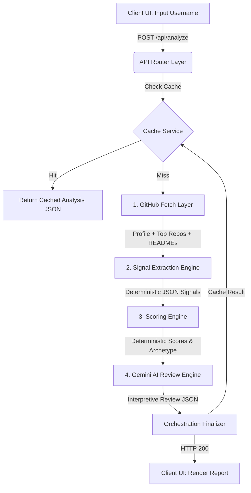

# 🛡️ Git-XRay — AI GitHub Profile Reviewer

[](https://nextjs.org/)
[](https://www.typescriptlang.org/)
[](https://ai.google.dev/)
[](https://supabase.com/)
[](https://tailwindcss.com/)
[](https://www.framer.com/motion/)

**Git-XRay** is an AI-powered GitHub profile analysis and review tool. It extracts metadata and repository-level details to compile deterministic developer scores and generates actionable, recruiter-style feedback using the **Google Gemini API**.

🔥 **107 unique users** have used the profile analysis feature all time!

```txt
GitHub Username ──> Deterministic Signals & Scores ──> AI-Powered Review
```

---

## 📖 Table of Contents
1. [Core Philosophy](#-core-philosophy)
2. [Technical Architecture](#-technical-architecture)
3. [Key Features](#-key-features)
4. [Folder Structure](#-folder-structure)
5. [Deterministic Scoring Engine Deep-Dive](#-deterministic-scoring-engine-deep-dive)
6. [Local Setup Guide](#-local-setup-guide)
7. [Database Setup (Supabase)](#-database-setup-supabase)
8. [Engineering & Pipeline Standards](#-engineering--pipeline-standards)
9. [Deployment](#-deployment)

---

## 🧠 Core Philosophy

**Git-XRay** evaluates developer profiles beyond raw commit counts and green contribution grids:
* **Code Stewardship & Deployability:** Evaluates project documentation, deployment links, repository maintainability, and active building patterns.
* **Deterministic Scoring + AI Feedback:** Quantitative scores are computed purely from raw GitHub metadata, while the Gemini LLM is used strictly to provide qualitative commentary, constructive feedback, and roasts.
* **Modern UI:** Built with a clean dark-mode layout, responsive metric cards, and Framer Motion animations.

---

## 🏗️ Technical Architecture

Git-XRay is built using the Next.js App Router. The candidate evaluation pipeline operates synchronously within an API route (`/api/analyze`):


```mermaid
graph TD
    A[Client UI: Input Username] -->|POST /api/analyze| B(API Router Layer)
    B -->|Check Cache| C{Cache Service}
    C -->|Hit| D[Return Cached Analysis JSON]
    C -->|Miss| E[1. GitHub Fetch Layer]
    E -->|Profile + Top Repos + READMEs| F[2. Signal Extraction Engine]
    F -->|Deterministic JSON Signals| G[3. Scoring Engine]
    G -->|Deterministic Scores & Archetype| H[4. Gemini AI Review Engine]
    H -->|Interpretive Review JSON| I[Orchestration Finalizer]
    I -->|Cache Result| C
    I -->|HTTP 200| J[Client UI: Render Report]
```

### The Pipeline Mechanics:
1. **Caching Layer:** Queries Supabase Cache (falling back to an in-memory Map cache if Supabase is unconfigured) to serve cached results within a 30-day TTL.
2. **GitHub Fetch Layer:** Connects to the GitHub REST API using `axios` to fetch user profile details and top public repositories (including README payloads).
3. **Signal Extraction Engine:** A deterministic module that parses documentation length, setup guides, and deployment configurations to extract raw developer signals.
4. **Scoring Engine:** Maps extracted signals to diagnostic categories (Consistency, Project Quality, Technical Depth, Profile Branding, Recruiter Readiness, Open Source) to form a deterministic Candidate Score.
5. **AI Review Engine (Gemini API):** Processes structured signals and scores to generate hiring match lists, highest-impact fixes, explainability highlights, and review formats.

---

## ⚡ Key Features

* **Profile & Repository Diagnostics:** Scans account age, bio completeness, follower counts, and repository activity.
* **Deployment & Documentation Detection:** Identifies live deployment links (Vercel, Netlify, Render, GitHub Pages) and evaluates README completeness.
* **Multi-Mode AI Reviews:** Provides standard recruiter-style reviews, brutal developer roasts, and dossier impressions.
* **Developer Archetypes:** Automatically classifies profiles (e.g., Full Stack Craftsman, AI/ML Explorer, Frontend Specialist).
* **Actionable Improvements:** Recommends specific, repository-level fixes to improve profile quality.
* **Shareable Summary & Caching:** Generates shareable review cards and caches report data to prevent redundant API calls.

---

## 📂 Folder Structure

```txt
src/
├── app/
│   ├── api/
│   │   └── analyze/
│   │       └── route.ts             # Main API pipeline orchestration
│   ├── page.tsx                     # Landing page entrypoint
│   ├── layout.tsx                   # Global CSS & HTML wrapping
│
├── components/
│   ├── landing/                     # Landing page panels & CTA widgets
│   ├── loading/                     # Scanning steps & animations
│   ├── report/                      # Report cards & Gauges
│
├── services/
│   ├── github/
│   │   └── github.service.ts        # GitHub API REST client
│   ├── signals/
│   │   └── signal-engine.ts         # Deterministic signal crawler
│   ├── scoring/
│   │   └── scoring-engine.ts        # Scoring algorithms
│   ├── ai/
│   │   └── gemini.service.ts        # Gemini API review generator
│   └── cache/
│       └── cache.service.ts         # Supabase + memory caching provider
│
├── types/
│   ├── github.types.ts              # API contracts for GitHub REST models
│   ├── signals.types.ts             # Definitions for computed signals
│   └── report.types.ts              # Output interface for completed reports
│
├── lib/                             # Core utilities and configs
└── utils/                           # General helpers and string formatters
```

---

## 🧮 Deterministic Scoring Engine Deep-Dive

Scores are calculated deterministically in code rather than left to LLM outputs:

| Score Category | Weight | Focus Areas | Computation Logic |
| :--- | :--- | :--- | :--- |
| **Consistency** | 15% | Development pacing and account lifespan | Combines active repo counts, recent pushes (last 90 days), and account age. |
| **Project Quality** | 25% | Documentation and production readiness | Evaluates average README scores and deployment configurations. |
| **Technical Depth** | 20% | Domain focus and architectural complexity | Rewards technical specialization paired with documentation. |
| **Profile Branding** | 15% | Public presentation and developer presence | Scans for website links, bios, avatars, and follower counts. |
| **Recruiter Ready** | 15% | Hireability signals | Weights live deployments, documentation compliance, and portfolio presence. |
| **Open Source** | 10% | Collaboration and social proof | Measures repository forks, community stars, and collaborative projects. |

### Developer Archetypes
The scoring engine categorizes developers into archetypes based on repository signals:
* 🤖 **AI / ML Explorer:** High Python saturation + active AI/ML projects.
* 🎨 **Frontend Craftsman:** High JS/TS focus + front-end framework topic density.
* ⚙️ **Backend Specialist:** Multi-database configurations + technical depth indexes.
* 🌐 **Open Source Explorer:** Collaborative project parameters + external contribution indexes.
* ⚡ **Hackathon Builder:** High repository velocity with frequent pushes.
* 🏆 **Full Stack Craftsman:** Balanced distribution of frontend/backend projects with a high overall score.

---

## 🚀 Local Setup Guide

Follow these steps to run Git-XRay locally:

### 1. Prerequisites
Ensure you have installed:
* [Node.js](https://nodejs.org/) (v18.0.0 or higher)
* [npm](https://www.npmjs.com/) or [yarn](https://yarnpkg.com/)
* A GitHub Personal Access Token
* A Google AI Studio API Key (for Gemini)

### 2. Clone the Repository
```bash
git clone https://github.com/Durgaprasad-Developer/Git-XRay.git
cd Git-XRay
```

### 3. Install Dependencies
```bash
npm install
```

### 4. Configure Environment Variables
Create a `.env.local` file in the root directory:
```env
# GitHub Token (Optional but recommended to prevent public rate limits)
GITHUB_TOKEN=your_github_personal_access_token

# Google Gemini API Key
GEMINI_API_KEY=your_gemini_api_key

# Supabase Configurations (Optional - falls back to memory cache if omitted)
SUPABASE_URL=your_supabase_project_url
SUPABASE_ANON_KEY=your_supabase_anon_key

# PostHog Analytics (Optional)
NEXT_PUBLIC_POSTHOG_KEY=your_posthog_client_key
NEXT_PUBLIC_POSTHOG_HOST=https://us.i.posthog.com
```

### 5. Start Development Server
```bash
npm run dev
```
Open [http://localhost:3000](http://localhost:3000) in your browser.

---

## 🗄️ Database Setup (Supabase)

Git-XRay uses Supabase to cache candidate reports for 30 days. To set up the caching database table:

1. Create a project at [Supabase](https://supabase.com/).
2. Navigate to the **SQL Editor**.
3. Run the following script:

```sql
-- ==========================================
-- GitHub Xray — Supabase Caching Schema Setup
-- ==========================================

-- 1. Create the caching table
CREATE TABLE IF NOT EXISTS public.cached_reports (
    username text PRIMARY KEY,
    report_json jsonb NOT NULL,
    created_at timestamp with time zone DEFAULT timezone('utc'::text, now()) NOT NULL
);

-- 2. Create index on username (lowercase) for fast lookups
CREATE INDEX IF NOT EXISTS idx_cached_reports_username_lower ON public.cached_reports (lower(username));

-- 3. Enable Row Level Security (RLS)
ALTER TABLE public.cached_reports ENABLE ROW LEVEL SECURITY;

-- 4. Create Public Access Policies
CREATE POLICY "Allow public read access" 
ON public.cached_reports 
FOR SELECT 
USING (true);

CREATE POLICY "Allow public insert access" 
ON public.cached_reports 
FOR INSERT 
WITH CHECK (true);

CREATE POLICY "Allow public update access" 
ON public.cached_reports 
FOR UPDATE 
USING (true)
WITH CHECK (true);

CREATE POLICY "Allow public delete access" 
ON public.cached_reports 
FOR DELETE 
USING (true);
```

---

## 📝 Engineering & Pipeline Standards

### Core Pipeline Principles:
1. **Payload Optimization:** Only precomputed developer signals and score summaries are sent to the Gemini model to keep payloads small and latency low.
2. **Deterministic Math:** All numerical scores are calculated arithmetically in Next.js services. The AI is used exclusively for generating text summaries, recommendations, and reviews.
3. **Graceful Fallbacks:** If the Gemini API or GitHub API encounters an issue or rate limit, fallback messaging ensures the user interface degrades gracefully.

---

## 📦 Deployment

### Deploying to Vercel
1. Push your repository to GitHub.
2. Import the project into [Vercel](https://vercel.com/new).
3. Add the required Environment Variables in Vercel settings.
4. Click **Deploy**.

### Production Build Locally
```bash
npm run build
npm run start
```

---

## 🤝 Contributing & Support

Contributions are welcome! Feel free to open a Pull Request or create an Issue.

Developed and maintained by [Durgaprasad-Developer](https://github.com/Durgaprasad-Developer).
